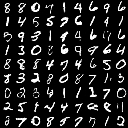

# Demo for DDPM

## Introduction

This is a demo for DDPM, which is a diffusion model for **image generation**. 

[paper](https://arxiv.org/abs/2006.11239)

## Requirements

```
einops==0.8.0
matplotlib==3.8.0
numpy==2.1.1
opencv_python==4.10.0.84
opencv_python_headless==4.10.0.84
torch==2.3.1+cu121
torchvision==0.19.0
torchvision==0.18.1+cu121
```

## Dataset

The dataset used in this project is [MNIST](http://yann.lecun.com/exdb/mnist/). You can get the dataset directly by running `train.py`. The dataset will be saved in `./data`.

## Models

There are two type of models in this project, one is the ConvNet, and the other is UNet. There are five different configurations for these models. The configurations are as follows:

```python
convnet_small_cfg = {
    'type': 'ConvNet',
    'intermediate_channels': [10, 20],
    'pe_dim': 128
}

convnet_medium_cfg = {
    'type': 'ConvNet',
    'intermediate_channels': [10, 10, 20, 20, 40, 40, 80, 80],
    'pe_dim': 256,
    'insert_t_to_all_layers': True
}

convnet_big_cfg = {
    'type': 'ConvNet',
    'intermediate_channels': [20, 20, 40, 40, 80, 80, 160, 160],
    'pe_dim': 256,
    'insert_t_to_all_layers': True
}

unet_1_cfg = {'type': 'UNet', 'channels': [10, 20, 40, 80], 'pe_dim': 128}

unet_res_cfg = {
    'type': 'UNet',
    'channels': [10, 20, 40, 80],
    'pe_dim': 128,
    'residual': True
}
```

## Usage

Run the project by running the following command:

```
python train.py [--ckpt_path /path/to/ckpt] [--device cuda:0] [--batch_size 1024] [--n_epochs 100] [--lr 1e-2] [--n_steps 1000] [--config_id 4] [--warm_start False] [--pretrained 0]
```

All these arguments are optional. If not specified, the default values will be used.

The argument `config_id` determines which configuration to use. The default value is 4, which is `unet_res_cfg`, the UNet with residual connections with the best results.

## Results

The results of the training process will be saved in `./sample`. Here is an example:



The pictures may be unrecognizable for using nets with a not good architrcture or not enough epochs.

